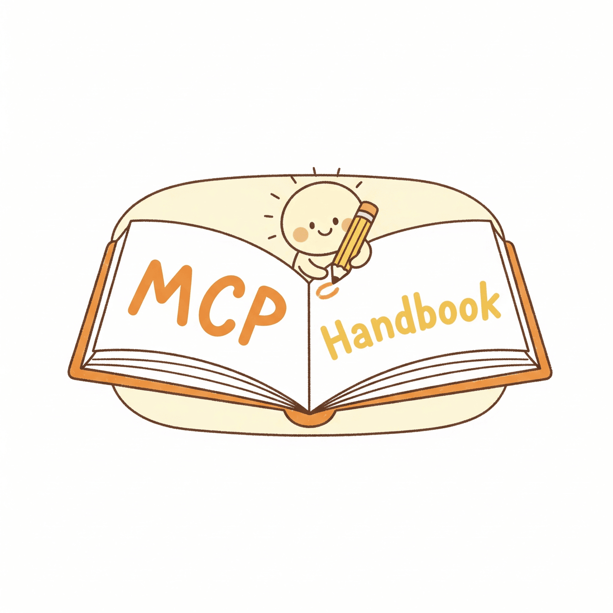

<div align="center">



# MCP 开发手册

### Model Context Protocol 开发者完全指南

[](../../LICENSE)
[](../../CONTRIBUTING.md)
[](https://github.com/ypollak2/mcp-handbook/actions/workflows/ci.yml)
[](https://spec.modelcontextprotocol.io)
[](../../examples/typescript/)
[](../../examples/python/)
[](../../examples/go/)
[](../../examples/rust/)
[](../../examples/java/)
[](../../examples/csharp/)
[](../../examples/kotlin/)

[English](../../README.md) | **中文（README + 指南 01-03）**

**84,000+** 开发者收藏了 MCP 服务器列表，却没有一个指南教你如何构建。

现在有了。

[快速开始](#快速开始) | [教程](#教程) | [示例](#示例) | [模板](#模板) | [参与贡献](#参与贡献)

**CI 已验证**：所有示例和入门模板都会在 GitHub Actions 中完成自动校验。

</div>

---

> [!TIP]
> **刚接触 MCP？** 从下面的[快速开始](#快速开始)开始 — 5 分钟内就能运行一个 MCP 服务器。
>
> **已经在开发？** 跳转到[架构模式](guides/03-architecture-patterns.md)查看生产级设计方案。

> [!NOTE]
> 中文版当前完整覆盖 README 和指南 01-03。其余指南暂时链接到英文原文，会逐步补齐。

## 为什么需要这个手册

MCP（Model Context Protocol，模型上下文协议）是连接 AI 助手与工具和数据的开放标准。由 Anthropic 推动，被 VS Code、Cursor、Claude Code 等众多 AI 工具采用。

**问题在于：** 生态中有 1,000+ 个 MCP 服务器，但几乎没有关于如何构建好它们的指南。开发者只能通过逆向工程源码来学习模式，反复踩同样的坑，最终将不安全的服务器部署到生产环境。

**这本手册解决了这个问题。** 这是我们在开发 MCP 服务器时希望拥有的指南 — 从 "Hello World" 到生产部署，覆盖模式、安全、测试和真实架构。

## 你将学到什么

```
你在这里
    │
    ├── 🟢 入门 ──────── 什么是 MCP？10 分钟构建你的第一个服务器
    │
    ├── 🟡 进阶 ──────── 架构模式、测试、错误处理
    │
    ├── 🔴 高级 ──────── 安全加固、生产部署、性能优化
    │
    └── 📋 参考 ──────── 模板、检查清单、SDK 对比
```

## 快速开始

5 分钟内构建一个可运行的 MCP 服务器。

### TypeScript

```bash
# 创建新项目
mkdir my-mcp-server && cd my-mcp-server
npm init -y
npm install @modelcontextprotocol/sdk zod
```

```typescript
// server.ts — 30 行代码的完整 MCP 服务器
import { McpServer } from "@modelcontextprotocol/sdk/server/mcp.js";
import { StdioServerTransport } from "@modelcontextprotocol/sdk/server/stdio.js";
import { z } from "zod";

const server = new McpServer({
  name: "my-first-server",
  version: "1.0.0",
});

// 添加一个 AI 助手可以调用的工具
server.tool(
  "greet",
  "为某人生成问候语",
  { name: z.string().describe("要问候的人的名字") },
  async ({ name }) => ({
    content: [{ type: "text", text: `你好，${name}！欢迎使用 MCP。` }],
  })
);

// 通过 stdio 传输连接
const transport = new StdioServerTransport();
await server.connect(transport);
```

```bash
# 使用 MCP Inspector 立即测试
npx @modelcontextprotocol/inspector node server.ts
```

### Python

```bash
# 创建新项目
mkdir my-mcp-server && cd my-mcp-server
pip install mcp
```

```python
# server.py — 20 行代码的完整 MCP 服务器
from mcp.server.fastmcp import FastMCP

mcp = FastMCP("my-first-server")

@mcp.tool()
def greet(name: str) -> str:
    """为某人生成问候语。"""
    return f"你好，{name}！欢迎使用 MCP。"

if __name__ == "__main__":
    mcp.run()
```

```bash
# 使用 MCP Inspector 立即测试
npx @modelcontextprotocol/inspector python server.py
```

> **下一步：** [将服务器连接到 Claude Desktop、VS Code 或 Cursor →](guides/01-getting-started.md)

## 教程

| # | 教程 | 难度 | 内容 |
|---|------|------|------|
| 01 | [入门指南](guides/01-getting-started.md) | 入门 | MCP 概念、第一个服务器、连接客户端 |
| 02 | [工具、资源和提示词](guides/02-core-concepts.md) | 入门 | MCP 服务器的三大构建模块 |
| 03 | [架构模式](guides/03-architecture-patterns.md) | 进阶 | 常见场景的服务器设计模式 |
| 04 | [错误处理](../../guides/04-error-handling.md) | 进阶 | 优雅降级、重试和友好的错误信息 |
| 05 | [测试 MCP 服务器](../../guides/05-testing.md) | 进阶 | 测试框架、模拟、属性测试、CI/CD |
| 06 | [安全与认证](../../guides/06-security.md) | 高级 | OAuth、RBAC、提示注入防御、审计日志 |
| 07 | [生产部署](../../guides/07-production.md) | 高级 | Docker、监控、扩展和可靠性 |
| 08 | [性能优化](../../guides/08-performance.md) | 高级 | 缓存、分页、大数据集流式传输 |
| 09 | [调试](../../guides/09-debugging.md) | 进阶 | Inspector、日志、常见问题与修复 |
| 10 | [高级主题](../../guides/10-advanced-topics.md) | 高级 | 采样、引导、OAuth、HTTP 传输、订阅 |

## 示例

可以学习和复用的真实 MCP 服务器。每个都包含 README、完整源码和连接 AI 客户端的说明。

### TypeScript

| 示例 | 展示内容 |
|------|---------|
| [数据库浏览器](../../examples/typescript/database-explorer/) | SQL 查询工具、Schema 资源、只读保护 |
| [REST API 包装器](../../examples/typescript/rest-api-wrapper/) | 将任意 REST API 转换为 MCP 服务器 |

### Python

| 示例 | 展示内容 |
|------|---------|
| [文件搜索](../../examples/python/file-search/) | 沙盒文件访问与内容搜索 |
| [网页抓取](../../examples/python/web-scraper/) | 获取和解析网页内容（纯标准库） |

### Go

| 示例 | 展示内容 |
|------|---------|
| [Hello Server](../../examples/go/hello-server/) | 使用 mcp-go SDK 的工具和资源 |

### Rust

| 示例 | 展示内容 |
|------|---------|
| [Hello Server](../../examples/rust/hello-server/) | 基于 trait 的 rmcp SDK 服务器 |

### Java

| 示例 | 展示内容 |
|------|---------|
| [Hello Server](../../examples/java/hello-server/) | 使用官方 Java SDK 的构建器模式服务器 |

### C#

| 示例 | 展示内容 |
|------|---------|
| [Hello Server](../../examples/csharp/hello-server/) | 使用官方 C# SDK 的 Hosted Server 和特性工具定义 |
| [REST API Wrapper](../../examples/csharp/rest-api-wrapper/) | 使用 `HttpClient` 注入和官方 C# SDK 包装 Hacker News API |

### Kotlin

| 示例 | 展示内容 |
|------|---------|
| [Hello Server](../../examples/kotlin/hello-server/) | 使用官方 Kotlin SDK 构建基于协程的 stdio 服务器 |
| [REST API Wrapper](../../examples/kotlin/rest-api-wrapper/) | 使用 Ktor 客户端和官方 Kotlin SDK 包装 Hacker News API |

## 语言矩阵

用这张表快速选择最适合你技术栈的起点。当前内容最完整的语言是 **TypeScript** 和 **Python**；本仓库里增长最快的官方 SDK 通道是 **C#** 和 **Kotlin**。

| 模式 | TypeScript | Python | Go | Rust | Java | C# | Kotlin |
|---|---|---|---|---|---|---|---|
| Minimal / Hello | [Minimal Template](../../templates/typescript-minimal/) | [Minimal Template](../../templates/python-minimal/) | [Hello Server](../../examples/go/hello-server/) | [Hello Server](../../examples/rust/hello-server/) | [Hello Server](../../examples/java/hello-server/) | [Hello Server](../../examples/csharp/hello-server/) | [Hello Server](../../examples/kotlin/hello-server/) |
| HTTP / API | [REST API Wrapper](../../examples/typescript/rest-api-wrapper/) | [Web Scraper](../../examples/python/web-scraper/) | - | - | - | [REST API Wrapper](../../examples/csharp/rest-api-wrapper/) | [REST API Wrapper](../../examples/kotlin/rest-api-wrapper/) |
| Database | [Database Explorer](../../examples/typescript/database-explorer/) | - | - | - | - | - | - |
| File System | - | [File Search](../../examples/python/file-search/) | - | - | - | - | - |

## 速查：工具 vs 资源 vs 提示词

```
使用工具（Tools）当：      使用资源（Resources）当：   使用提示词（Prompts）当：
├─ 操作有副作用            ├─ 暴露只读数据            ├─ 提供可复用的
│  （写入、发送、创建）    │  （文件、配置、数据库）  │  提示词模板
├─ 调用时需要输入参数      ├─ 数据有自然的 URI        ├─ 引导 AI 的
│                          │  （file://、db://）       │  任务处理方式
└─ 返回操作结果            └─ 客户端可能缓存或        └─ 编码领域
                              订阅更新                    专业知识
```

## SDK 对比

| | TypeScript | Python | Go | Rust | Java | C# | Kotlin |
|---|---|---|---|---|---|---|---|
| **包名** | `@modelcontextprotocol/sdk` | `mcp` | `mcp-go` | `rmcp` | `io.modelcontextprotocol:sdk` | `ModelContextProtocol` | `io.modelcontextprotocol:kotlin-sdk-server` |
| **服务器创建** | `new McpServer(...)` | `FastMCP(...)` | `server.NewMCPServer(...)` | `impl Server` trait | `McpServer.sync(...)` | `builder.Services.AddMcpServer()` | `Server(Implementation(...), ServerOptions(...))` |
| **工具定义** | `server.tool()` | `@mcp.tool()` | `s.AddTool()` | `fn list_tools()` | `.tool(new SyncToolSpec)` | `[McpServerTool]` | `server.addTool(...)` |
| **传输层** | `StdioServerTransport` | `mcp.run()` | `server.ServeStdio()` | `stdio()` | `StdioServerTransportProvider` | `.WithStdioServerTransport()` | `StdioServerTransport(...)` |
| **成熟度** | 最成熟 | 快速迭代中 | 活跃开发 | 早期阶段 | 活跃（Spring AI） | 官方维护，迭代快 | 官方维护，迭代快 |
| **适合** | 生产服务器 | 快速原型 | 高性能二进制 | 性能关键场景 | 企业 / Spring | .NET 服务 | Kotlin / JVM 团队 |

## 参与贡献

这本手册是社区共同努力的成果，欢迎各种规模的贡献。

**快速参与方式：**
- 修复错别字或改善说明
- 添加新的示例服务器
- 分享你发现的模式
- 将教程翻译成其他语言

详见 [CONTRIBUTING.md](../../CONTRIBUTING.md)。

## 许可证

MIT 许可证。详见 [LICENSE](../../LICENSE)。

---

<div align="center">

**觉得有用？给个 &#11088; 帮助更多开发者发现它。**

由社区构建，为社区服务。

[报告问题](../../issues) · [建议主题](../../issues/new?template=new-topic.md) · [参与贡献](../../CONTRIBUTING.md)

</div>
